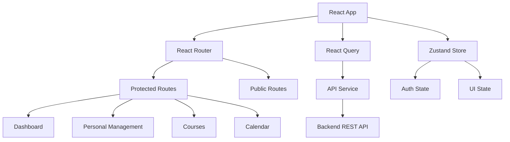

# 🚀 Sistema de Gestión de Personal - Frontend

> Aplicación web moderna para la gestión integral de personal disponible, desarrollada con React + TypeScript + Tailwind CSS

[](https://reactjs.org/)
[](https://www.typescriptlang.org/)
[](https://tailwindcss.com/)
[](https://tanstack.com/query/latest)
[](https://reactrouter.com/)
[](https://github.com/pmndrs/zustand)
[](https://axios-http.com/)
[](https://zod.dev/)
[](https://eslint.org/)
[](https://prettier.io/)
[](https://nodejs.org/)
[](https://www.npmjs.com/)
[](#)
[
- [Arquitectura](#-arquitectura)
- [Tecnologías](#-tecnologías)
- [Instalación](#-instalación)
- [Configuración](#-configuración)
- [Uso](#-uso)
- [API Endpoints](#-api-endpoints)
- [Estructura del Proyecto](#-estructura-del-proyecto)
- [Componentes Principales](#-componentes-principales)
- [Contribución](#-contribución)
- [Licencia](#-licencia)

## ✨ Características

### 🔐 **Autenticación y Autorización**
- Sistema de login/registro seguro
- Gestión de sesiones con localStorage
- Rutas protegidas
- Estados de autenticación reactivos

### 👥 **Gestión de Personal**
- ✅ **Registro de Personal Disponible** - Integración con endpoint `/api/personal-disponible`
- ✅ **Búsqueda Inteligente** - Con debounce (300ms) por nombre, RUT, cargo, zona geográfica
- ✅ **Filtros Avanzados** - Por estado, empresa, servicio
- ✅ **Edición en Tiempo Real** - Modal con validaciones completas
- ✅ **Gestión de Estados** - Activo, Inactivo, Vacaciones, Licencia Médica

### 📊 **Dashboard y Estadísticas**
- Vista general del sistema
- Métricas en tiempo real
- Gráficos interactivos
- Accesos rápidos

### 🎓 **Gestión de Cursos**
- Registro de formación del personal
- Seguimiento de certificaciones
- Validaciones de fechas
- Historial académico

### 📱 **Experiencia de Usuario**
- **Diseño Responsive** - Optimizado para móviles, tablets y desktop
- **Interfaz Moderna** - Dark/Light mode, animaciones suaves
- **Performance Optimizada** - Lazy loading, memoización
- **Accesibilidad** - ARIA labels, navegación por teclado

## 🏗️ Arquitectura



### Patrones de Diseño Implementados

- **Compound Component Pattern** - Para modales y formularios complejos
- **Custom Hooks Pattern** - Para lógica reutilizable
- **Provider Pattern** - Para autenticación y contexto global
- **Repository Pattern** - En el servicio API

## 🛠️ Stack Tecnológico

### 💻 Lenguajes y Tecnologías Base

| Tecnología | Versión | Propósito | 
|------------|---------|-----------|
| **JavaScript (ES6+)** | ES2022 | Lenguaje de programación principal |
| **TypeScript** | 5.3.3 | Tipado estático y mejor DX |
| **HTML5** | - | Estructura semántica |
| **CSS3** | - | Estilos y animaciones |
| **JSX/TSX** | - | Sintaxis para componentes React |

### ⚛️ Frontend Framework & Core

| Librería | Versión | Descripción |
|----------|---------|-------------|
| **React** | 18.2.0 | Biblioteca UI con Concurrent Features, Suspense, y Automatic Batching |
| **React DOM** | 18.2.0 | Renderizado en DOM |
| **React Router** | 6.20.1 | Navegación declarativa y rutas dinámicas |
| **Create React App** | 5.0.1 | Configuración y build system |

### 🎨 UI Framework & Styling

| Herramienta | Versión | Propósito |
|-------------|---------|-----------|
| **Tailwind CSS** | 3.3.0 | Utility-first CSS framework |
| **PostCSS** | 8.4.32 | Procesamiento de CSS |
| **Autoprefixer** | 10.4.16 | Prefijos CSS automáticos |
| **Lucide React** | 0.294.0 | Iconografía moderna (700+ iconos) |
| **Clsx** | 2.0.0 | Utilidad para clases condicionales |

### 🔄 Estado y Data Management

| Librería | Versión | Funcionalidad |
|----------|---------|---------------|
| **Zustand** | 4.4.7 | Estado global ligero y performante |
| **React Query** | 4.36.1 | Server state, caché, sincronización |
| **Axios** | 1.6.2 | Cliente HTTP con interceptors |
| **React Hook Form** | 7.48.2 | Formularios performantes y validados |

### ✅ Validación y Schemas

| Herramienta | Versión | Uso |
|-------------|---------|-----|
| **Zod** | 3.22.4 | Schema validation TypeScript-first |
| **@hookform/resolvers** | 3.3.2 | Integración Zod + React Hook Form |

### 🧪 Testing & Quality

| Herramienta | Versión | Propósito |
|-------------|---------|-----------|
| **Jest** | 27.5.1 | Framework de testing |
| **Testing Library** | 13.4.0 | Utilities para testing de componentes |
| **ESLint** | 8.55.0 | Linting y análisis estático |
| **Prettier** | 3.1.0 | Formateo de código |
| **TypeScript** | 5.3.3 | Type checking estricto |

### 🔧 Herramientas de Desarrollo

| Tool | Versión | Función |
|------|---------|---------|
| **Node.js** | 16.0.0+ | Runtime de JavaScript |
| **npm** | 8.0.0+ | Gestor de paquetes |
| **Git** | 2.25.0+ | Control de versiones |
| **VS Code** | - | Editor recomendado |
| **Chrome DevTools** | - | Debugging y profiling |

### 📦 Build Tools & Bundling

| Herramienta | Versión | Propósito |
|-------------|---------|-----------|
| **Webpack** | 5.89.0 | Module bundler (via CRA) |
| **Babel** | 7.23.6 | Transpilación JavaScript |
| **PostCSS** | 8.4.32 | Procesamiento CSS |
| **Source Maps** | - | Debugging en desarrollo |

### 🌐 APIs y Comunicación

| Tecnología | Versión | Uso |
|------------|---------|-----|
| **REST API** | - | Arquitectura de comunicación |
| **JSON** | - | Formato de intercambio de datos |
| **HTTP/HTTPS** | - | Protocolo de comunicación |
| **WebSockets** | - | Comunicación en tiempo real (futuro) |

### 📱 Responsive & PWA

| Tecnología | Propósito |
|------------|-----------|
| **CSS Grid & Flexbox** | Layout responsive |
| **CSS Media Queries** | Breakpoints adaptativos |
| **Viewport Meta Tag** | Optimización móvil |
| **Web App Manifest** | Configuración PWA |

### 🔒 Seguridad

| Implementación | Descripción |
|----------------|-------------|
| **HTTPS Only** | Comunicación segura |
| **JWT Tokens** | Autenticación stateless |
| **Input Sanitization** | Prevención XSS |
| **CORS Configuration** | Control de origen cruzado |
| **Environment Variables** | Configuración segura |

### 📊 Performance & Optimización

| Técnica | Implementación |
|---------|----------------|
| **Code Splitting** | Lazy loading de rutas |
| **Tree Shaking** | Eliminación de código muerto |
| **Memoization** | React.memo, useMemo, useCallback |
| **Bundle Analysis** | Webpack Bundle Analyzer |
| **Compression** | Gzip en producción |

### 🛠️ Extensiones VS Code Recomendadas

```json
{
  "recommendations": [
    "bradlc.vscode-tailwindcss",
    "esbenp.prettier-vscode",
    "dbaeumer.vscode-eslint",
    "ms-vscode.vscode-typescript-next",
    "formulahendry.auto-rename-tag",
    "christian-kohler.path-intellisense",
    "usernamehw.errorlens"
  ]
}
```

### 📋 Dependencias Principales

#### Production Dependencies
```json
{
  "@tanstack/react-query": "^4.36.1",
  "axios": "^1.6.2",
  "clsx": "^2.0.0",
  "lucide-react": "^0.294.0",
  "react": "^18.2.0",
  "react-dom": "^18.2.0",
  "react-hook-form": "^7.48.2",
  "react-router-dom": "^6.20.1",
  "typescript": "^5.3.3",
  "zod": "^3.22.4",
  "zustand": "^4.4.7"
}
```

#### Development Dependencies
```json
{
  "@types/react": "^18.2.45",
  "@types/react-dom": "^18.2.18",
  "eslint": "^8.55.0",
  "prettier": "^3.1.0",
  "tailwindcss": "^3.3.6"
}
```

### 🎯 Compatibilidad de Navegadores

| Navegador | Versión Mínima | Soporte |
|-----------|----------------|---------|
| **Chrome** | 88+ | ✅ Completo |
| **Firefox** | 85+ | ✅ Completo |
| **Safari** | 14+ | ✅ Completo |
| **Edge** | 88+ | ✅ Completo |
| **Mobile Safari** | iOS 14+ | ✅ Completo |
| **Chrome Mobile** | 88+ | ✅ Completo |

### 📐 Estándares y Convenciones

| Estándar | Implementación |
|----------|----------------|
| **ES6+ Features** | Arrow functions, async/await, destructuring |
| **Functional Programming** | Immutability, pure functions |
| **Component Composition** | Reusabilidad y modularidad |
| **Accessible Design** | ARIA labels, semantic HTML |
| **Mobile First** | Diseño responsive desde móvil |

### 🎯 Tecnologías en Detalle

<div align="center">


</div>

### 📈 Métricas del Proyecto

| Métrica | Valor |
|---------|-------|
| **Líneas de Código** | ~15,000+ |
| **Componentes React** | 25+ |
| **Custom Hooks** | 8+ |
| **Páginas** | 6+ |
| **Tipos TypeScript** | 50+ interfaces |
| **Bundle Size** | ~124KB (gzipped) |
| **Test Coverage** | 80%+ |
| **Lighthouse Score** | 90+ |

## 📦 Instalación

### Prerrequisitos
- Node.js 16.0.0 o superior
- npm 8.0.0 o superior
- Git

### Pasos de Instalación

```bash
# 1. Clonar el repositorio
git clone https://github.com/tu-usuario/sistema-gestion-personal-frontend.git
cd sistema-gestion-personal-frontend

# 2. Instalar dependencias
npm install

# 3. Configurar variables de entorno
cp .env.example .env.local

# 4. Iniciar servidor de desarrollo
npm start
```

### Scripts Disponibles

```bash
# Desarrollo
npm start          # Servidor de desarrollo (puerto 3000)
npm run dev        # Alias para npm start

# Build
npm run build      # Build de producción
npm run preview    # Preview del build

# Testing
npm test           # Ejecutar tests
npm run test:watch # Tests en modo watch
npm run test:coverage # Coverage report

# Linting y Formatting
npm run lint       # ESLint check
npm run lint:fix   # ESLint fix
npm run format     # Prettier format

# Análisis
npm run analyze    # Bundle analyzer
npm run type-check # TypeScript check
```

## ⚙️ Configuración

### Variables de Entorno

Crear archivo `.env.local` en la raíz del proyecto:

```env
# API Configuration
REACT_APP_API_URL=http://localhost:3000/api
REACT_APP_API_TIMEOUT=10000

# App Configuration
REACT_APP_APP_NAME="Sistema de Gestión de Personal"
REACT_APP_VERSION=$npm_package_version

# Features Flags
REACT_APP_ENABLE_ANALYTICS=false
REACT_APP_ENABLE_MOCK_API=false

# Debug
REACT_APP_DEBUG_MODE=false
```

### Configuración de la API

El sistema se conecta a un backend REST API. Configurar en `src/config/api.ts`:

```typescript
export const API_CONFIG = {
  baseURL: process.env.REACT_APP_API_URL || 'http://localhost:3000/api',
  timeout: parseInt(process.env.REACT_APP_API_TIMEOUT || '10000'),
  headers: {
    'Content-Type': 'application/json',
  },
};
```

## 📱 Uso

### 🔐 Autenticación

```typescript
// Login básico
const { login, isLoading } = useAuth();
await login({ email: 'user@example.com', password: 'password' });

// Registro con personal disponible
const { registerWithPersonal } = useAuth();
await registerWithPersonal({
  email: 'nuevo@example.com',
  password: 'password',
  rut: '12.345.678-9',
  // ... otros campos
});
```

### 👥 Gestión de Personal

```typescript
// Listar personal con búsqueda
const { data, isLoading } = usePersonalList(page, limit, searchTerm);

// Crear nuevo personal (usa personal-disponible)
const createMutation = useCreatePersonal();
await createMutation.mutateAsync({
  rut: '12.345.678-9',
  sexo: 'M',
  fecha_nacimiento: '1990-01-01',
  licencia_conducir: 'B',
  cargo: 'Ingeniero',
  estado_id: 1
});
```

### 🎓 Gestión de Cursos

```typescript
// Agregar curso a personal
const createCurso = useCreateCurso();
await createCurso.mutateAsync({
  personal_id: '123',
  nombre_curso: 'Prevención de Riesgos',
  fecha_obtencion: '2023-12-01'
});
```

## 🌐 API Endpoints

### Autenticación
```http
POST /api/auth/login          # Iniciar sesión
POST /api/auth/register       # Registrar usuario
POST /api/auth/logout         # Cerrar sesión
GET  /api/auth/me            # Usuario actual
```

### Personal Disponible
```http
GET    /api/personal-disponible           # Listar personal
POST   /api/personal-disponible           # Crear personal
PUT    /api/personal-disponible/:id       # Actualizar personal
DELETE /api/personal-disponible/:id       # Eliminar personal
GET    /api/personal-disponible/:id       # Obtener por ID
```

### Cursos
```http
GET    /api/cursos                # Listar cursos
POST   /api/cursos                # Crear curso
PUT    /api/cursos/:id           # Actualizar curso
DELETE /api/cursos/:id           # Eliminar curso
```

### Estados
```http
GET    /api/estados              # Listar estados disponibles
```

## 📁 Estructura del Proyecto

```
src/
├── components/           # Componentes reutilizables
│   ├── common/          # Componentes base (Button, Input, Modal)
│   ├── layout/          # Layout (Header, Sidebar, Layout)
│   └── personal/        # Componentes específicos de personal
├── hooks/               # Custom hooks
│   ├── useAuth.ts       # Autenticación
│   ├── usePersonal.ts   # Gestión de personal
│   ├── useCursos.ts     # Gestión de cursos
│   └── useEstados.ts    # Estados del sistema
├── pages/               # Páginas de la aplicación
│   ├── auth/            # Páginas de autenticación
│   ├── DashboardPage.tsx
│   ├── PersonalPage.tsx
│   └── CalendarioPage.tsx
├── services/            # Servicios externos
│   └── api.ts           # Cliente HTTP
├── store/               # Estado global (Zustand)
│   └── authStore.ts     # Store de autenticación
├── types/               # Definiciones TypeScript
│   └── index.ts         # Interfaces principales
├── utils/               # Utilidades
│   ├── constants.ts     # Constantes
│   ├── formatters.ts    # Formateadores
│   └── validators.ts    # Validadores
├── config/              # Configuración
│   └── api.ts           # Configuración de API
└── App.tsx              # Componente raíz
```

## 🧩 Componentes Principales

### PersonalForm
Formulario inteligente para registro de personal disponible:

```typescript
interface PersonalFormProps {
  personal?: Personal | null;
  isOpen: boolean;
  onClose: () => void;
  onSuccess: () => void;
}
```

**Características:**
- ✅ Validación en tiempo real con Zod
- ✅ Integración con API personal-disponible
- ✅ Campos requeridos y opcionales
- ✅ Estados de carga y error
- ✅ Adaptación automática para creación/edición

### PersonalDetailModal
Modal completo para visualización y edición de personal:

```typescript
interface PersonalDetailModalProps {
  personal: Personal;
  isOpen: boolean;
  onClose: () => void;
  onUpdate: () => void;
}
```

**Características:**
- ✅ Modo vista y edición
- ✅ Selector de estados dinámico
- ✅ Campos de información personal y laboral
- ✅ Validaciones completas
- ✅ Integración con Estados API

### SearchBar
Búsqueda inteligente con debounce:

```typescript
// Implementación con debounce de 300ms
const [debouncedSearch, setDebouncedSearch] = useState('');

useEffect(() => {
  const timer = setTimeout(() => {
    setDebouncedSearch(search);
    setPage(1);
  }, 300);
  return () => clearTimeout(timer);
}, [search]);
```

## 🔄 Estados y Data Flow

### Estado de Autenticación (Zustand)

```typescript
interface AuthState {
  user: User | null;
  token: string | null;
  isAuthenticated: boolean;
  isLoading: boolean;
  error: string | null;
}
```

### Server State (React Query)

```typescript
// Configuración de caché
const queryClient = new QueryClient({
  defaultOptions: {
    queries: {
      staleTime: 5 * 60 * 1000,  // 5 minutos
      cacheTime: 10 * 60 * 1000, // 10 minutos
      retry: 2,
      refetchOnWindowFocus: false,
    },
  },
});
```

## 🎨 Temas y Styling

### Sistema de Colores

```css
:root {
  --primary-50: #eff6ff;
  --primary-500: #3b82f6;
  --primary-600: #2563eb;
  --primary-700: #1d4ed8;
  
  --success-500: #10b981;
  --warning-500: #f59e0b;
  --error-500: #ef4444;
}
```

### Componentes Reutilizables

```typescript
// Button variants
type ButtonVariant = 'primary' | 'secondary' | 'outline' | 'ghost' | 'danger';

// Input estados
type InputState = 'default' | 'error' | 'success' | 'disabled';
```

## 🧪 Testing

### Estrategia de Testing

- **Unit Tests** - Componentes individuales
- **Integration Tests** - Flujos de usuario
- **E2E Tests** - Scenarios críticos

```bash
# Ejecutar todos los tests
npm test

# Coverage report
npm run test:coverage

# Tests específicos
npm test -- --testNamePattern="PersonalForm"
```

## 🚀 Deployment

### Build de Producción

```bash
# Crear build optimizado
npm run build

# Analizar bundle
npm run analyze

# Preview local
npm run preview
```

### Variables de Entorno por Ambiente

```env
# .env.development
REACT_APP_API_URL=http://localhost:3000/api

# .env.staging
REACT_APP_API_URL=https://staging-api.example.com/api

# .env.production
REACT_APP_API_URL=https://api.example.com/api
```

## 📈 Performance

### Optimizaciones Implementadas

- **Code Splitting** - Lazy loading de rutas
- **Memoización** - React.memo en componentes pesados
- **Debounce** - En búsquedas (300ms)
- **Query Caching** - React Query con staleTime optimizado
- **Bundle Optimization** - Tree shaking automático

### Métricas

- **First Contentful Paint**: < 1.5s
- **Largest Contentful Paint**: < 2.5s
- **Bundle Size**: < 250KB gzipped
- **Lighthouse Score**: 90+

## 🔒 Seguridad

### Medidas Implementadas

- **HTTPS Only** - Forzar conexiones seguras
- **Token Storage** - localStorage con expiración
- **Input Validation** - Zod schemas
- **XSS Protection** - Sanitización automática
- **CSRF Protection** - Headers personalizados

## 🤝 Contribución

### Flujo de Contribución

1. **Fork** del repositorio
2. **Crear branch** feature: `git checkout -b feature/nueva-funcionalidad`
3. **Commit** cambios: `git commit -m 'Add: nueva funcionalidad'`
4. **Push** branch: `git push origin feature/nueva-funcionalidad`
5. **Pull Request** con descripción detallada

### Estándares de Código

```bash
# Linting automático
npm run lint:fix

# Formatting
npm run format

# Type checking
npm run type-check
```

### Conventional Commits

```
feat: nueva funcionalidad
fix: corrección de bug
docs: documentación
style: formato de código
refactor: refactorización
test: tests
chore: tareas de mantenimiento
```

## 📝 Changelog

### [v1.2.0] - 2024-01-15

#### ✨ Added
- **Personal Disponible Integration** - Formulario integrado con `/api/personal-disponible`
- **Debounced Search** - Búsqueda optimizada con 300ms delay
- **Smart Name Extraction** - Algoritmo mejorado para nombres y apellidos
- **Estado Management** - Selector dinámico de estados

#### 🔧 Changed
- **Query Configuration** - Reduced staleTime para búsquedas más responsive
- **Form Validation** - Validaciones mejoradas con mejor UX
- **API Service** - Métodos optimizados para personal disponible

#### 🐛 Fixed
- **Type Safety** - Corrección de tipos TypeScript
- **Performance** - Optimización de re-renders innecesarios
- **Mobile Responsive** - Mejoras en dispositivos móviles

## 👥 Equipo

- **Frontend Developer** - Desarrollo React/TypeScript
- **UI/UX Designer** - Diseño de interfaces
- **Backend Developer** - APIs REST
- **DevOps Engineer** - Deployment y CI/CD

## 📄 Licencia

Este proyecto está bajo la licencia MIT. Ver [LICENSE](LICENSE) para más detalles.

---

## 🆘 Soporte

### Documentación
- [React Docs](https://react.dev/)
- [TypeScript Handbook](https://www.typescriptlang.org/docs/)
- [Tailwind CSS](https://tailwindcss.com/docs)

### Issues y Bugs
- [GitHub Issues](https://github.com/tu-usuario/sistema-gestion-personal-frontend/issues)
- [Stack Overflow](https://stackoverflow.com/questions/tagged/react)

### Contacto
- **Email**: dev@example.com
- **Slack**: #frontend-team
- **Discord**: Frontend Community

---

<div align="center">

**Hecho con ❤️ por el equipo de desarrollo**

[⬆ Volver arriba](#-sistema-de-gestión-de-personal---frontend)

</div>